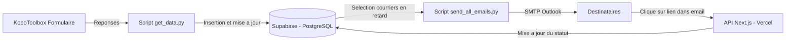

# 📬 Gestion des Courriers – Vivo Energy

## 📖 Description

Ce projet automatise la **gestion des courriers entrants** via un flux complet allant de la collecte à l’alerte email.

- 📥 **Formulaire KoboToolbox** : collecte des données de suivi des courriers.  
- 🗄 **Base de données Supabase (PostgreSQL)** : stockage centralisé des courriers et de leurs métadonnées.  
- ⚙ **Scripts Python** :  
  - `get_data.py` : récupère les données Kobo et les insère dans Supabase.  
  - `send_email.py` : envoie un rappel aux destinataires des courriers en retard.  
  - `send_all_emails.py` : envoie des rappels pour tous les courriers en retard.  
- 📡 **API Vercel (Next.js)** : permet la mise à jour du statut des courriers depuis un lien dans l’email.  
- 📧 **Envoi d’emails** : via **Outlook SMTP** avec mot de passe d’application (authentification sécurisée).  


---

## 📊 Schéma d’architecture


## ⚙️ Fonctionnement

1. **Collecte des données**  
   Les courriers sont enregistrés via un formulaire KoboToolbox.  
   Chaque soumission contient : référence, destinataire, email, objet, date de réception, criticité, échéance, etc.

2. **Stockage dans Supabase**  
   Les données sont insérées dans la table `gestion_courier` de Supabase.  
   Le script Python gère la mise à jour des enregistrements existants.

3. **Envoi d'emails**  
   Les courriers dont le **statut** est `en_cours` et dont l’échéance est dépassée déclenchent un **email de rappel**.  
   L’email contient un lien vers l’API Vercel qui permet de **marquer le courrier comme traité**.

4. **Mise à jour du statut**  
   L’API Next.js (hébergée sur Vercel) reçoit l’appel du lien et met à jour la ligne correspondante dans Supabase.
## 🔄 Automatisation avec GitHub Actions

Le flux est automatisé via **GitHub Actions** :

- **Exécution programmée (cron)** pour :
  - Lancer `get_data.py` et mettre à jour Supabase.
  - Lancer `send_all_emails.py` pour notifier les destinataires.

### Exemple de workflow `.github/workflows/automation.yml`

```yaml
name: Get Data & Send Emails (Mon-Fri, Every 2 Min)

on:
  schedule:
    # Run every 2 minutes, Monday–Friday
    - cron: "*/2 * * * 1-5"
  workflow_dispatch:

jobs:
  get_and_send:
    runs-on: ubuntu-latest
    steps:
      - uses: actions/checkout@v4
      
      - name: Set up Python
        uses: actions/setup-python@v5
        with:
          python-version: "3.11"
      
      - name: Install dependencies
        run: pip install -r requirements.txt
      
      - name: Run get_data.py
        run: python get_data.py
        env:
          API_TOKEN: ${{ secrets.API_TOKEN }}
          FORM_UID: ${{ secrets.FORM_UID }}
          BASE_URL: ${{ secrets.BASE_URL }}
          DATABASE_URL: ${{ secrets.DATABASE_URL }}
          API_URL: ${{ secrets.API_URL }}

      - name: Run send_all_emails.py
        run: python send_all_emails.py
        env:
          DATABASE_URL: ${{ secrets.DATABASE_URL }}
          EMAIL_HOST: ${{ secrets.EMAIL_HOST }}
          EMAIL_PORT: ${{ secrets.EMAIL_PORT }}
          OUTLOOK_EMAIL: ${{ secrets.OUTLOOK_EMAIL }}  # ✅ Match your Python code
          OUTLOOK_PASS: ${{ secrets.OUTLOOK_PASS }}    # ✅ Match your Python code
          EMAIL_FROM: ${{ secrets.OUTLOOK_EMAIL }}     # ✅ Always send from Outlook
          API_URL: ${{ secrets.API_URL }}

