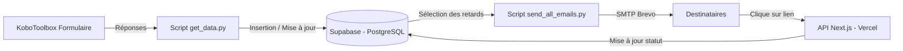

# 📬 Gestion des Courriers – Vivo Energy

## 📖 Description

Ce projet automatise la **gestion des courriers entrants** via un flux complet allant de la collecte à l’alerte email.

- 📥 **Formulaire KoboToolbox** : collecte des données de suivi des courriers.
- 🗄 **Base de données Supabase (PostgreSQL)** : stockage centralisé des courriers et de leurs métadonnées.
- ⚙ **Scripts Python** :
  - `get_data.py` : récupère les données Kobo et les insère dans Supabase.
  - `send_email.py` : envoie un rappel aux destinataires des courriers en retard.
  - `send_all_emails.py` : envoie des rappels pour tous les courriers en retard.
- 📡 **API Vercel (Next.js)** : permet la mise à jour du statut des courriers depuis un lien dans l’email.
- 📧 **Envoi d’emails** : via le service SMTP de [Brevo](https://www.brevo.com).

---

## 📊 Schéma d’architecture



## ⚙️ Fonctionnement

1. **Collecte des données**  
   Les courriers sont enregistrés via un formulaire KoboToolbox.  
   Chaque soumission contient : référence, destinataire, email, objet, date de réception, criticité, échéance, etc.

2. **Stockage dans Supabase**  
   Les données sont insérées dans la table `gestion_courier` de Supabase.  
   Le script Python gère la mise à jour des enregistrements existants.

3. **Envoi d'emails**  
   Les courriers dont le **statut** est `en_cours` et dont l’échéance est dépassée déclenchent un **email de rappel**.  
   L’email contient un lien vers l’API Vercel qui permet de **marquer le courrier comme traité**.

4. **Mise à jour du statut**  
   L’API Next.js (hébergée sur Vercel) reçoit l’appel du lien et met à jour la ligne correspondante dans Supabase.
## 🔄 Automatisation avec GitHub Actions

Le flux est automatisé via **GitHub Actions** :

- **Exécution programmée (cron)** pour :
  - Lancer `get_data.py` et mettre à jour Supabase.
  - Lancer `send_all_emails.py` pour notifier les destinataires.

### Exemple de workflow `.github/workflows/automation.yml`

```yaml
name: Gestion Courriers

on:
  schedule:
    - cron: "0 8 * * *"  # Tous les jours à 08h UTC
  workflow_dispatch:

jobs:
  run-scripts:
    runs-on: ubuntu-latest
    steps:
      - uses: actions/checkout@v3

      - name: Configurer Python
        uses: actions/setup-python@v4
        with:
          python-version: "3.12"

      - name: Installer les dépendances
        run: |
          pip install -r requirements.txt

      - name: Lancer récupération Kobo
        run: python backend/get_data.py

      - name: Lancer envoi des emails
        run: python backend/send_all_emails.py
        env:
          EMAIL_USER: ${{ secrets.EMAIL_USER }}
          EMAIL_PASS: ${{ secrets.EMAIL_PASS }}
          API_URL: ${{ secrets.API_URL }}
          DB_HOST: ${{ secrets.DB_HOST }}
          DB_PORT: ${{ secrets.DB_PORT }}
          DB_NAME: ${{ secrets.DB_NAME }}
          DB_USER: ${{ secrets.DB_USER }}
          DB_PASSWORD: ${{ secrets.DB_PASSWORD }}

